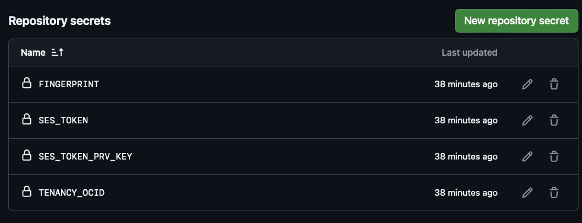
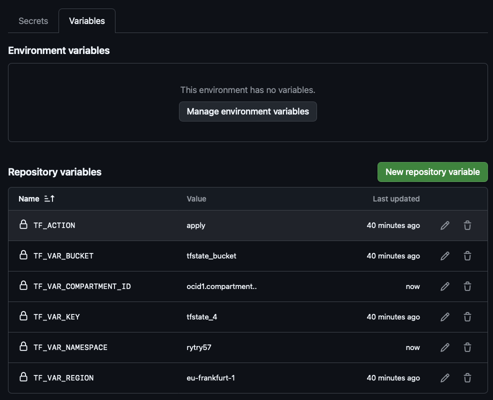

# deploy_vcn_in_oci
## deploy a VCN in OCI using Terraform from github action with oci backend and session token

The code demonstrate how to manage OCI resources with Terraform from Github Actions. 

It uses:
- [Security Token Authentication](https://docs.oracle.com/en-us/iaas/Content/dev/terraform/configuring.htm#security-token-auth)
- [terraform native OCI backend](https://developer.hashicorp.com/terraform/language/backend/oci) to store the terraform state file

Basically you will generate a [Session Token](https://docs.oracle.com/en-us/iaas/Content/API/SDKDocs/clitoken.htm) with OCI CLI.
This token and the private key file will be store in github action secrets and it will be used to authenticate to OCI.
The token will expired however after __exp_time__ minutes.

## Prerequisites

- The script runs bash/shell commands. Ideally use an Unix environment
- The terraform code will store the statefile in a bucket in tenancy. This bucket must exists.
- GitHub CLI (_gh_) installed and configured
- Python3 and OCI CLI must be installed

## procedure to setup the secrets and vars automatically - if you have github cli installed


- These can be updated/set automatically with a script (_scripts/github_set_var_secrets.sh_) if you have github CLI installed and you are authenticated to your github.

1. If you have [github cli](https://cli.github.com) installed and you setup the authentication to your gitrepo then it becomes easy to setup the github secrets and github vars by running the script _github_set_var_secrets.sh_ as it shows below  

- clone the repo
- go to _script_ folder
- check if you are authenticated to your github account
```
  oci> gh auth status
  github.com
  ✓ Logged in to github.com account franciscvass (keyring)
  - Active account: true
  - Git operations protocol: https
  - Token: gho_************************************
  - Token scopes: 'gist', 'read:org', 'repo'
```
- if you are indeed authenticated then you can run the below after you are sure you filled all these parameters
```
./github_set_var_secrets.sh --region eu-frankfurt-1 \
--exp_time 120 \
--profile tf_ion5 \
--githubrepo franciscvass/deploy_vcn_in_oci \
--tf_action apply \
--tf_var_bucket tfstate_bucket \
--tf_var_compartment_id ocid1.compartment...... \
--tf_var_key tfstate_4 \
--tf_var_namespace idjua567865fghf
```
- the arguments are described here:

  --exp_time:              How much time in minutes the token will be valid

  --profile:               the profile that will be added to your oci config file

  --tf_action:             Usually this is __apply__.

  --tf_var_bucket:         the name of an __existing__ bucket where will store the statefile

  --tf_var_compartment_id: The ocid of comp where will create the resources

  --tf_var_key:            the name of the terraform state file

  --tf_var_namespace:      the Namespace of your Tenant 


- running the above will __open a web browser and will require you to login in the Tenancy__
- Provide the info to login and wait for script to finish
- the above action it will add a config profile to your oci/config file under the profile you specify in _profile_

2. The above script it will create a local file _set_token.sh_ which will contains info that will update the vars and secrets in your Github repo. __Do not share this file.__

4. Run the Action from your github repo 

## procedure to setup the secrets and vars manually - if you do not have github cli installed

1. Create the Secrets and Vars in github repo as you see below:

- Secrets
  


- Vars

- 

- If you don't have the github istalled or you are not authenticated to Github you must set the Vars ans Secrets manually


2. Get the variables and secrets

- go to _scripts_ folder
- Run _github_get_var_secrets.sh_ as shown below

```
./github_get_var_secrets.sh --region eu-frankfurt-1 \
--exp_time 120 \
--profile tf_ion5 \
--githubrepo franciscvass/deploy_vcn_in_oci \
--tf_action apply \
--tf_var_bucket tfstate_bucket \
--tf_var_compartment_id ocid1.compartment...... \
--tf_var_key tfstate_4 \
--tf_var_namespace idjua567865fghf
```
3. The above script will generate a file _info_for_github.txt_ with the values of Vars and Secrets you must update manually in your github repo. __Do not share this file.__

4. Run the Action from your github repo
